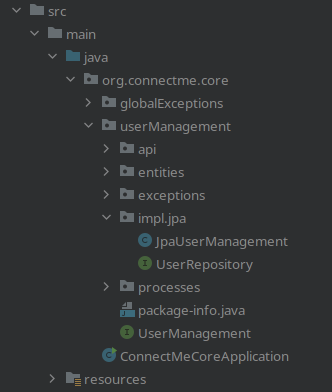

- The Project Structure is **Component Oriented**
	- Features are organized into components (component=feature implementation) => Each domain of the application gets its own component (e.g. `chat`, `userManagement`, `feeds`)
	- Each component (like the `userManagement` package) has
		- a `package-info.java` => ^^description of the component purpose and other notes^^
		- an _component interface_ such as `UserManagement` => Access to main package functionality from the _outside_ (=other components)
		- An implementation of the _component interface_ (in this example `impl.jpa.JpaUserManagement`)
		- optionally sub-packages for Exceptions, APIs, Entities
- 
- Every component gets its own Java package.
- # Advantages
	- Each domain of the application has its own package => Code becomes more manageable
	- Components can be re-implemented just by adding another implementation of the interface
	- Components can be seen as their own little projects, creating a smaller and more manageable scope for the programmer
	- In the future each component could be extracted out of the monolith and build as its own service
- # Disadvantages
	- Use of interfaces and multiple possible implementations => Complexity
	-