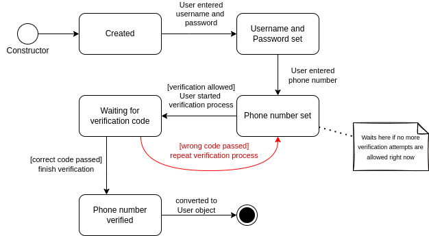

- # Process steps and states
	- The Registration Process has multiple steps
		- 1) User enters username and password
		- 2) User enters his phone number
		- 3) Verification code is generated and sent to passed phone number
		- 4) User enters verification code in order to verify phone number
		- 5) Profile is verified
		- 6) User is registered
	- 
	- Only certain interactions are allowed at each state. If other interactions are attempted a `IllegalStateException` is thrown.
- # Process vulnerabilities and counter actions
	- ## Inputs of the clumsy user
		- Taken username => availability must be checked
		- Invalid username => **Syntax Check**
		- Weak password => password strength test
		- Wrong phone number => **SMS verification**
		- Invalid phone number (typo) => Phone number syntax check
		- Wrong verification code (typo) => Repeat verification process
	- ## Actions of the clumsy user
		- Ends registration mid process => No database persistence along this process, store in session
	- ## Inputs of the evil user
		- code injection => charset limitation and syntax checking
		- too long inputs => limit input length
		- profane username => **Profanity Check**
	- ## Actions of the evil user
		- Repeat verification process infinite times => restrict attempts per time per user
			- e.g. limit of 3 attempts. User will be blocked for 5mins after those
		- Bypass verification block by restarting (=resetting) registration process => keep registration object in session and check if process restart/reset is allowed
		-
- # Implementation
	- The Registration Process is controlled and represented by the `Registration` object **stored in the user's session**. It is a **State Machine**.
		- In every method the current state is checked in order to prevent illegal access
		- In almost every method the state is changed
		- That means, that higher logic only needs to work with the objects responses to certain interactions => nothing=allowed action, exception=forbidden action.
	- The states of this object are defined in `RegistrationState`.